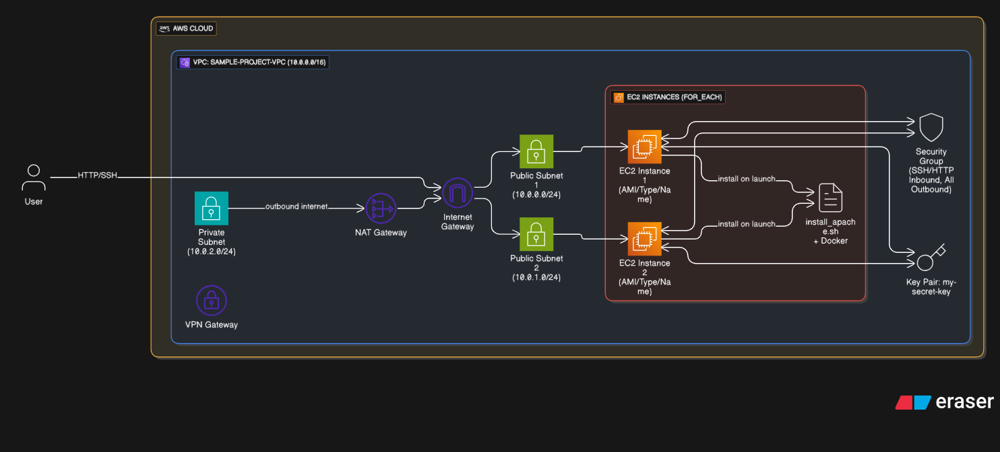

# 🚀 Terraform Multi-Instance Deployment using `for_each`



This project provisions a dynamic and scalable AWS infrastructure using Terraform. It uses the `for_each` construct to deploy multiple EC2 instances across public subnets, while maintaining flexibility and reusability via variables and modules.

---

## 📦 What This Project Does

✅ Provisions the following infrastructure:

- **VPC** with:
  - 2 Public Subnets (`10.0.0.0/24`, `10.0.1.0/24`)
  - 1 Private Subnet (`10.0.2.0/24`)
  - NAT Gateway, Internet Gateway, and VPN Gateway
- **4 EC2 Instances** (based on `ec2_instance_list` variable):
  - `ubuntu-1`, `ubuntu-2` → Subnet 1
  - `amazon-linux-1`, `amazon-linux-2` → Subnet 2
- **Security Group** with:
  - Inbound: SSH (22), HTTP (80) from anywhere
  - Outbound: All traffic
- **Key Pair** to SSH into instances
- **User Data** script:
  - Installs Apache and Docker
  - Starts Apache service

---

## ✅ Prerequisites

Before running Terraform commands, ensure the following:

- 🧑‍💻 AWS CLI is configured (`aws configure`)
- ⚙️ **Terraform v1.0+** installed
- 🛠️ **Git** installed
- 🔑 An SSH **public key** file named `my-secret-key.pub` in this directory  
  *(or modify `key_pair.tf` with your key)*

---

## 📁 Project Structure

```bash
.
├── main.tf
├── terraform.tf
├── variables.tf
├── key_pair.tf
├── ec2.tf
├── vpc.tf
├── security_group.tf
├── install_apache.sh           # User data script
├── my-secret-key.pub           # Your public SSH key
├── terraform.tfvars            # Define ec2_instance_list, etc.
├── infra-structure.png         # Diagram of infrastructure
├── .gitignore
└── README.md
```

---

## 🚀 How to Use

### 1️⃣ Clone the Repository

```bash
git clone <your-repo-url>
cd <your-repo-folder>
```

---

### 2️⃣ Initialize Terraform

```bash
terraform init
```

---

### 3️⃣ Review the Plan

```bash
terraform plan
```

---

### 4️⃣ Apply the Configuration

```bash
terraform apply -auto-approve
```

---

## 📜 Notes

- EC2 instances are created using `for_each` over the `ec2_instance_list` variable.
- Subnets are dynamically selected using the `subnet_index` provided per instance.
- Default region is `ap-south-1` (Mumbai). Change via `variables.tf` or `terraform.tfvars`.
- Apache and Docker are installed via `install_apache.sh`.

---

## 📤 Output

After a successful deployment, Terraform will show outputs like:

- ✅ EC2 public IPs and hostnames
- ✅ VPC ID and subnet IDs
- ✅ Security group ID

---

## 🔐 SSH into Your Instances

```bash
ssh -i my-secret-key ubuntu@<public-ip>
```

Replace `<public-ip>` with one shown in your Terraform outputs.

---

## 🧹 To Destroy the Infrastructure

```bash
terraform destroy
```

---

## 👤 Author

**Aditya Bahuguna** – Built with 💙 using Terraform and AWS

---

## 📄 License

Free and open-source for educational or commercial use.
